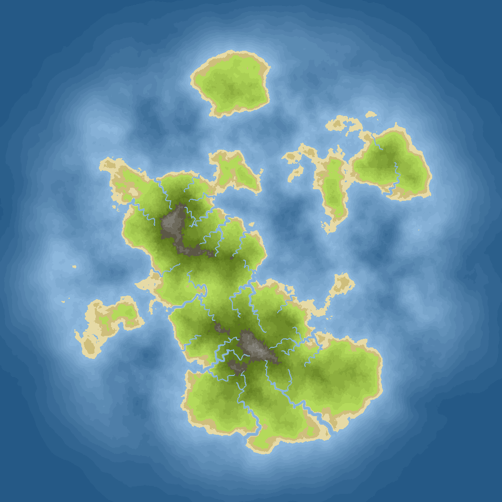
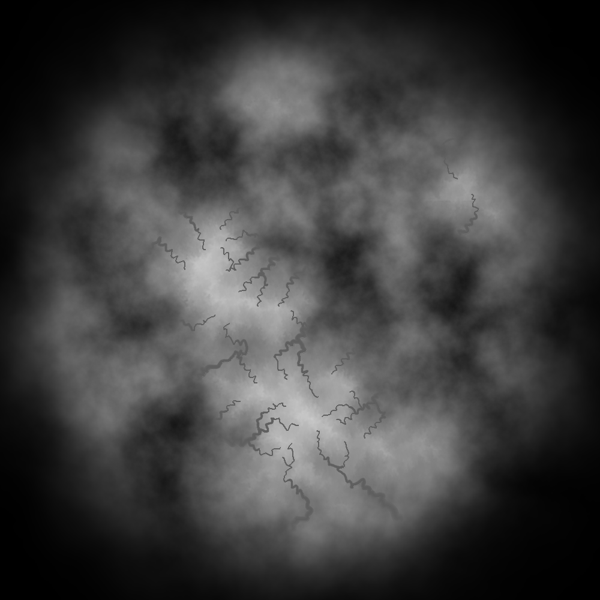

# Squares
version 0-5_21_23

## Required Libraries
* TGUI 0.9 (not included in repo)
* SFML 2.5.1 (not included in repo)
* nlohmann-json
* FastNoiseLite
* stb_image_write

The libraries that aren't included should be downloaded and put into the libs directory with the names 'SFML' and 'TGUI' to compile.

## Map Generation
Currently, the only feature in squares.
* Color Map Example:

* Height Map Example:
