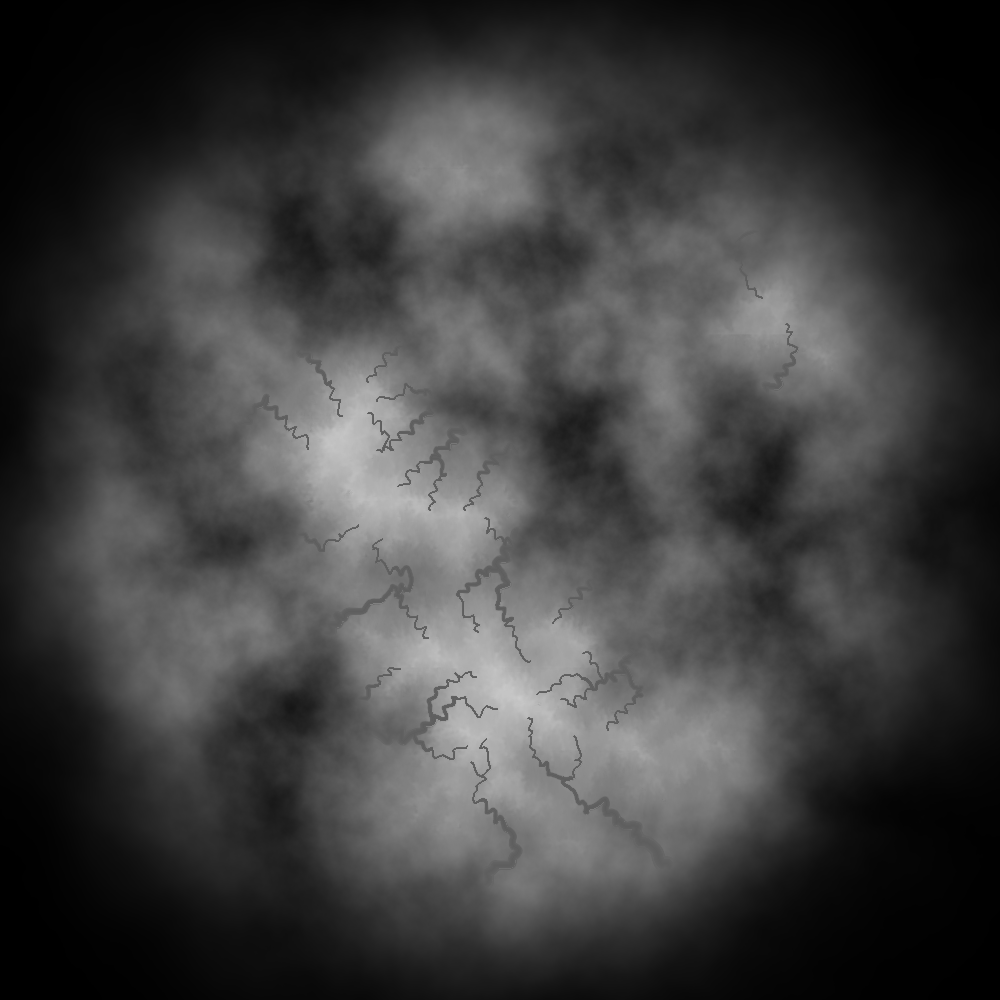

# Squares
version 0-5_21_23

## Required Libraries
* TGUI 0.9 [download here](https://tgui.eu/download/)
* SFML 2.5.1 [download here](https://www.sfml-dev.org/download/sfml/2.5.1/)
* nlohmann-json [download here](https://github.com/nlohmann/json)
* FastNoiseLite [included]
* stb_image_write [included]

The libraries that aren't included should be downloaded and put into the libs directory with the names 'SFML', 'TGUI', and 'JSON' to compile.

## Map Generation
Currently, the only feature in squares.
* Color Map Example:

* Height Map Example:
